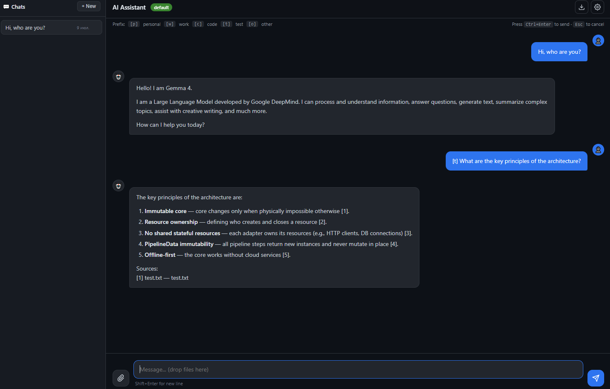

# AI Assistant

Local AI assistant framework. FastAPI + RAG with namespaces.
Offline-first, OpenAI-compatible LLM/embedder adapters.

**Solo-maintained.** This project is developed for personal use. AI writes the code; I set the direction. Published as-is — no contributions accepted.

## What is this

- **LLM**: any OpenAI-compatible server (llama.cpp, Ollama, vLLM, etc.)
- **Embedder**: any OpenAI-compatible server (nomic-embed-text, etc.)
- **Reranker**: optional API-based reranking (set `provider: null` to disable)
- **Vector store**: FAISS (persistent) or memory (ephemeral)
- **Storage**: SQLite
- **API**: OpenAI-compatible HTTP API (`/v1/chat/completions`, `/v1/models`) + native endpoints



## Requirements

- Python 3.11+
- LLM server running (llama.cpp, Ollama, vLLM, or any OpenAI-compatible endpoint)
- Embedder server running (any OpenAI-compatible endpoint)

## Quick Start

### 1. Install

**Windows (PowerShell):**
```powershell
python -m venv .venv
.venv\Scripts\Activate.ps1
pip install .
# Optional: FAISS for persistent vector store
pip install .[faiss]
```

**macOS / Linux:**
```bash
python -m venv .venv
source .venv/bin/activate
pip install .
# Optional: FAISS for persistent vector store
pip install .[faiss]
```

> **Windows note:** If `pip install .` fails with `Microsoft Visual C++ 14.0 is required`, install [Build Tools for Visual Studio](https://visualstudio.microsoft.com/visual-cpp-build-tools/) or use pre-built wheels.

### 2. Configure

```bash
# Copy example config
cp config.example.yaml config.yaml
# Windows: Copy-Item config.example.yaml config.yaml
```

Edit `config.yaml`. Minimum required changes:

```yaml
# 1. LLM endpoint and model
llm:
  provider: openai_compatible
  api_base: http://127.0.0.1:8080/v1
  model: your-model-name

# 2. Embedder endpoint and model (must match vector_store.dim!)
embedder:
  provider: openai_compatible
  api_base: http://127.0.0.1:8081/v1
  model: your-embedder-model
  dim: 768

# 3. Vector store (must match embedder.dim!)
vector_store:
  provider: faiss
  dim: 768

# 4. Document sources for RAG
#    Supported formats: .md, .txt (plain text files only)
rag:
  sources:
    - namespace: mydocs
      path: /path/to/your/documents   # Windows: D:\path\to\docs
      include: ["*.md", "*.txt"]
      recursive: true

# 5. Namespace prefix for chat
#    prefix: single character used in chat, e.g. [m] query
#    prompt: rag_strict | rag_default | rag_creative
namespaces:
  mydocs:
    prefix: m
    chunk_size: 512
    prompt: rag_strict
```

### 3. Download Tokenizers (local models only)

Required once for local models (Llama, Qwen, Gemma, Phi, etc.). Skip for cloud OpenAI models.

```bash
python scripts/download_tokenizers.py
```

### 4. Download Engine and Models (local llama.cpp only)

Skip this step if using Ollama, vLLM, or cloud OpenAI.

**Engine:** Download `llama-server` from [llama.cpp releases](https://github.com/ggerganov/llama.cpp/releases) and place in `vendor/llama/`.

**Models:** Place GGUF models in `vendor/models/`. Download from [HuggingFace](https://huggingface.co/models).

### 5. Start Servers

**If using local llama.cpp models** (starts LLM + embedder + API in one command):
```bash
python run_servers.py
```

> **Note:** `run_servers.py` expects `vendor/llama/llama-server` and models in `vendor/models/`.

**If using external servers** (starts API only; assumes LLM/embedder already running):
```bash
python -m uvicorn ai_assistant.main:create_app --reload
```

### 6. Verify Installation

With servers running, test the connections:

**Check LLM:**
```bash
python scripts/check_llm.py
```

**Check RAG pipeline:**
```bash
python scripts/check_rag.py
```

**Quick API test (PowerShell):**
```powershell
Invoke-RestMethod -Uri "http://127.0.0.1:8000/v1/chat/completions" -Method Post -ContentType "application/json" -Body '{"model":"your-model-name","messages":[{"role":"user","content":"Hello"}]}'
```

**Quick API test (curl):**
```bash
curl -X POST http://127.0.0.1:8000/v1/chat/completions \
  -H "Content-Type: application/json" \
  -d '{"model":"your-model-name","messages":[{"role":"user","content":"Hello"}]}'
```

Open http://localhost:8000/ui in your browser.

> **Auth note:** Legacy endpoints (`/api/v1/*`) require `Authorization: Bearer <key>` if `security.api_key` is set in `config.yaml`. OpenAI-compatible endpoints (`/v1/*`) do not require a key by default.

## Configuration Reference

Key sections in `config.yaml`:

| Section | Purpose |
|---------|---------|
| `llm` | Model, API endpoint, sampling parameters |
| `embedder` | Embedding model, dimension (must match `vector_store.dim`) |
| `reranker` | Optional reranking API (set `provider: null` to disable) |
| `vector_store` | FAISS or memory, index path, dimension |
| `chunker` | Document splitting strategy |
| `chat` | History limit, max context tokens |
| `rag` | Pipeline steps, top_k, thresholds, document `sources` |
| `namespaces` | Per-namespace prefix, chunk size, prompt override |
| `storage` | SQLite database path |
| `security` | API key, `admin_enabled`, body size limits |
| `logging` | Level, format (text/json), rotation |
| `cors` / `ui` | Cross-origin and static file settings |

`config.yaml` is git-ignored. `config.example.yaml` is the template in repo.

## Daily Use

### First-Time Indexing

After configuring `rag.sources`, open the web UI at `http://localhost:8000/ui` and click the **Index** button in the header (arrow-up icon). Choose whether to clear the existing index, then start. The task runs in the background; status updates automatically.

Repeat this whenever you add or change document sources.

### RAG Namespaces

RAG is opt-in. Start a message with a namespace prefix to search documents:

```
[m] what is the architecture?   → searches "mydocs" namespace
```

Messages without a prefix go directly to LLM.

Configure prefixes per namespace in `config.yaml`:

```yaml
namespaces:
  mydocs:
    prefix: m
    chunk_size: 512
    prompt: rag_strict
```

### Index Documents

After adding or editing `rag.sources`, open the web UI and click the **Index** button in the header. You can also trigger reindex via API:

```bash
curl -X POST http://127.0.0.1:8000/api/v1/rag/reindex \
  -H "Content-Type: application/json" \
  -d '{"folder": "mydocs"}'
```

### Chat Exports

Save and index chat history via `/api/v1/rag/save-chat`. Toggle in `config.yaml` via `rag.index_chat_exports`.

### Admin Endpoints

Disabled by default. Set `security.admin_enabled: true` to expose `/admin/*`.

## API Examples

### OpenAI-Compatible Chat

**PowerShell:**
```powershell
Invoke-RestMethod -Uri "http://127.0.0.1:8000/v1/chat/completions" -Method Post -ContentType "application/json" -Body '{"model":"your-model-name","messages":[{"role":"user","content":"[m] what is this?"}]}'
```

**curl:**
```bash
curl -X POST http://127.0.0.1:8000/v1/chat/completions \
  -H "Content-Type: application/json" \
  -d '{"model":"your-model-name","messages":[{"role":"user","content":"[m] what is this?"}]}'
```

### Native RAG Query

```bash
curl -X POST http://127.0.0.1:8000/api/v1/rag/query \
  -H "Content-Type: application/json" \
  -d '{"query":"[m] what is this?", "namespace":"mydocs"}'
```

### List Namespaces

```bash
curl http://127.0.0.1:8000/api/v1/rag/namespaces
```

## Helper Scripts

Optional diagnostic and maintenance scripts in `scripts/`. Most users only need `download_tokenizers.py` once.

| Script | When to run |
|--------|-------------|
| `download_tokenizers.py` | **Once**, after installing local models |
| `check_llm.py` | Verify LLM connection |
| `check_rag.py` | Test full RAG pipeline |
| `check_all.py` | Run all checks |
| `kill.py` | Emergency shutdown of all servers |
| `clean_cache.py` | Remove temporary / cache files |
| `context_build.py` | Build project context for AI assistance |
| `open_shell.py` | Interactive shell with project imports |
| `structure.py` | Print project file structure |

Run any script directly:

```bash
python scripts/<script>.py
```

Or use the interactive menu:

```bash
python run_scripts.py
```

## Troubleshooting

### `ModuleNotFoundError: No module named 'faiss'`

Install FAISS separately:
```bash
pip install faiss-cpu
```

### `Connection refused` to LLM or embedder

Verify servers are running:
```bash
# Check LLM
curl http://127.0.0.1:8080/v1/models

# Check embedder
curl http://127.0.0.1:8081/v1/models
```

### `embedder.dim != vector_store.dim`

Edit `config.yaml` — both must match:
```yaml
embedder:
  dim: 768
vector_store:
  dim: 768
```

### RAG returns "I do not have enough information"

1. Check indices exist: `curl http://127.0.0.1:8000/api/v1/rag/namespaces`
2. Check `namespaces` in `config.yaml` is not empty and has a `prefix`
3. Re-index via the **Index** button in the web UI
4. Check prefix matches: `[m]` must match `namespaces.mydocs.prefix: m`

### `401 Unauthorized` on `/api/v1/*` endpoints

Legacy endpoints require API key. Either:
- Set `security.api_key: your-key` in `config.yaml`
- Or use OpenAI-compatible endpoint `/v1/chat/completions` (no key required by default)

### Background reindex never completes

Check status:
```bash
curl http://127.0.0.1:8000/api/v1/rag/reindex/status/your-task-id
```

Tasks time out after 4 hours. Only one reindex runs at a time.

## License

Licensed under the Apache License 2.0. See [LICENSE](LICENSE) for details.
